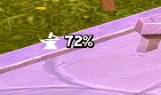
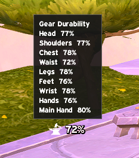
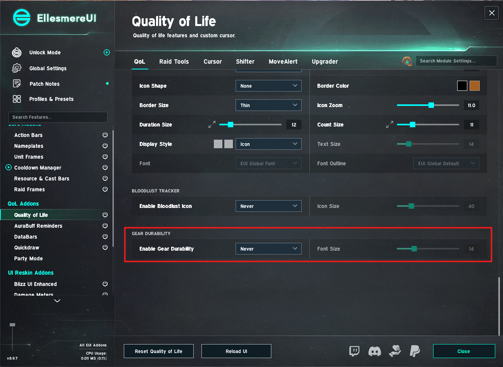
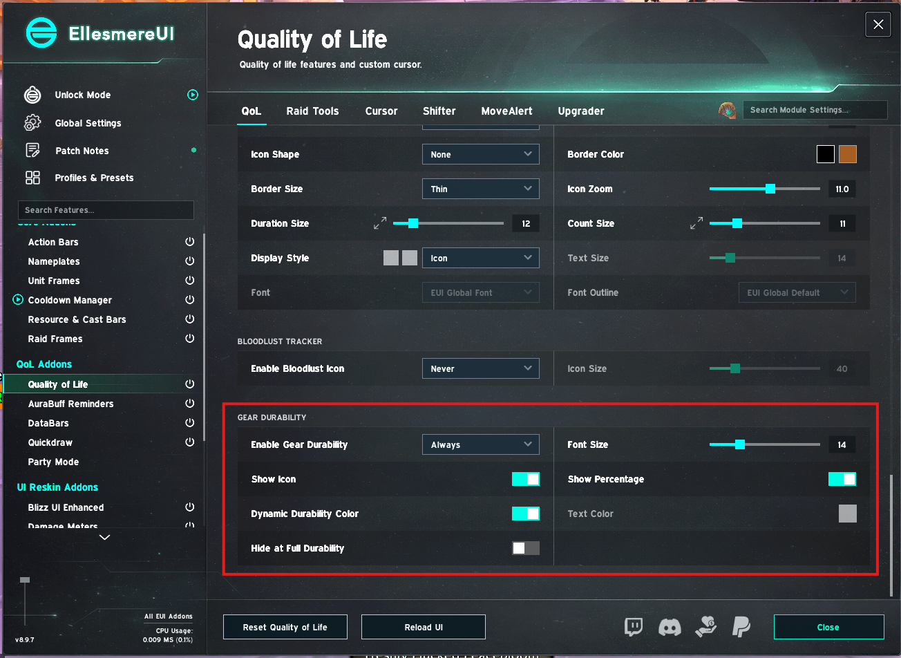
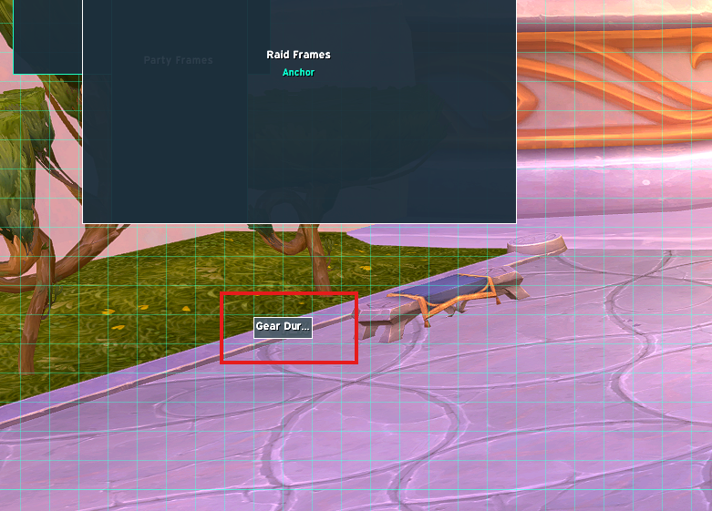

# EllesmereUI - Gear Durability

A standalone companion addon for World of Warcraft Retail (Midnight 12.1), based on Andrew Painter's [EllesmereUI PR #1635](https://github.com/EllesmereGaming/EllesmereUI/pull/1635). Use the durability display while the proposed integrated feature is awaiting review.

**[Download the latest release](https://github.com/apainter2/EllesmereUIGearDurability/releases/latest)**

## What it does

- Shows a compact icon and percentage for the **lowest durability among your equipped repairable items**, rounded down. For example, if your weakest item is at 72%, the display reads `72%`.
- Colours the readout from white at full durability towards red as durability falls; at 20% or below it reaches the strongest warning colour. A custom static colour is also available.
- Hover for a per-slot durability breakdown.
- Move it independently using EllesmereUI Unlock Mode.
- Toggle the icon and percentage separately, choose a font size, and optionally hide the display at full durability.
- Refreshes on durability changes, equipment changes, combat end, resurrection, vendor close, and entering the world. No polling or `OnUpdate` loop.
- Defaults **off**. The display and durability event handler are built only on first enable. Disabling unregisters the durability events.

It reports durability; it does not repair gear automatically.

## Requirements and installation

1. Install **EllesmereUI v9.2.2** (or v9.2.1). This release was checked against both versions and declares the 12.1 client interface (`120100`).
2. Download **EllesmereUIGearDurability-v0.1.0.zip** from Releases.
3. Extract the `EllesmereUIGearDurability` folder into `World of Warcraft/_retail_/Interface/AddOns/`.
4. Restart WoW if it was running, then enable the addon in the character-selection AddOns list.
5. Type **`/egd`**, tick **Enable display**, and use **Move in Unlock Mode** to position it.

The final path should be `Interface/AddOns/EllesmereUIGearDurability/EllesmereUIGearDurability.toc`.

Only the EllesmereUI core is required. The QoL and DataBars modules do not need to be enabled. When DataBars is installed, its forge texture is reused; otherwise the addon uses WoW's built-in blacksmithing icon.

## Settings and movement

| Command | Action |
| --- | --- |
| `/egd` or `/egd options` | Open the companion settings window |
| `/egd enable` | Enable the display |
| `/egd disable` | Hide it and unregister durability events |
| `/egd move` | Enable the display and open EllesmereUI Unlock Mode; unavailable in combat |
| `/egd reset` | Reset this addon's settings and position, returning to disabled |
| `/egd help` | Show command help |

The settings window includes font size, icon/percentage visibility, dynamic colour, static RGB sliders, hide-at-full, and reset-position controls. Static colour sliders become available when dynamic colour is off. If both icon and percentage are disabled, the display is hidden.

Settings and position persist **per character** in `EllesmereUIGearDurabilityDB`. They are independent of EllesmereUI profiles and the original PR's QoL settings. Switching a suite profile does not select different companion settings.

## How this differs from the PR

The durability calculation, warning gradient, tooltip and event-driven refresh are adapted from the PR, including its follow-up durability refresh fix.

The companion has its own `/egd` window instead of the PR's **Quality of Life -> Keys, Logs & Brez** options. It uses private SavedVariables and a distinct Unlock Mode entry, **Gear Durability (Companion)**. It does not patch suite files or replace the built-in DataBars durability block.

If you also run a build containing PR #1635, enable only one of the two durability displays to avoid duplicate readouts. Disabling or removing this companion is sufficient when moving to the integrated feature; settings are not migrated automatically.

## Screenshots from PR #1635

These are the author's original **in-game screenshots of the integrated PR version**, copied from [PR #1635](https://github.com/EllesmereGaming/EllesmereUI/pull/1635). They illustrate the readout, tooltip and positioning. They are **not screenshots or proof of in-game testing of this standalone release**. The companion's options window and Unlock Mode label differ; the icon also differs when DataBars is absent.

### Durability readout

### Hover breakdown

### Before activation

### After activation

### Unlock Mode

## Validation

Lua 5.1 syntax checks and the mocked runtime checks in `tests/run.lua` cover lazy startup, minimum durability, refresh events, tooltip data, visibility, settings-window construction, movement, reset, frame reuse and namespace isolation. Run them from the repository root with `lua tests/run.lua`.

**The standalone addon still needs in-game testing.** The PR author's earlier in-game testing applies to the integrated PR version. To verify this release: enable it, damage and repair equipment, swap gear, hover for slot values, move it, `/reload` to check persistence, toggle hide-at-full, and disable it. Check that there are no Lua errors and that changes are reflected without reloading.

## Credits

Author: Andrew Painter. Adapted from the author's PR #1635, branch commit `2190ab7f7d59c976f69bded00ba593db9a5dba39`. EllesmereUI provides the font, tooltip and Unlock Mode helpers; durability maths and warning colours follow its DataBars implementation. The forge texture remains in the EllesmereUI installation and is not bundled here. This is an independent companion, not an official EllesmereUI release.
